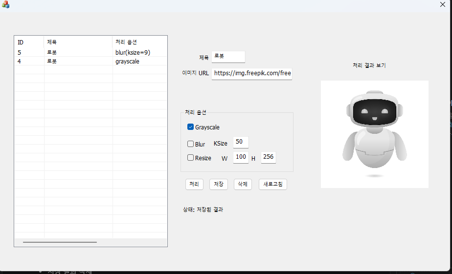
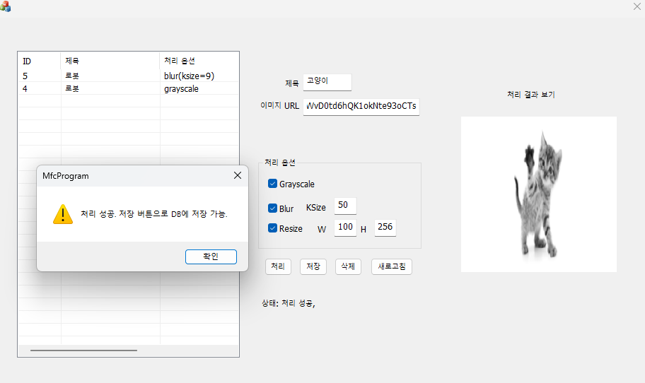
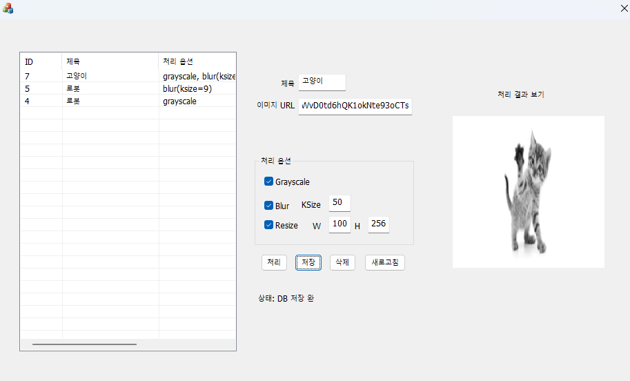
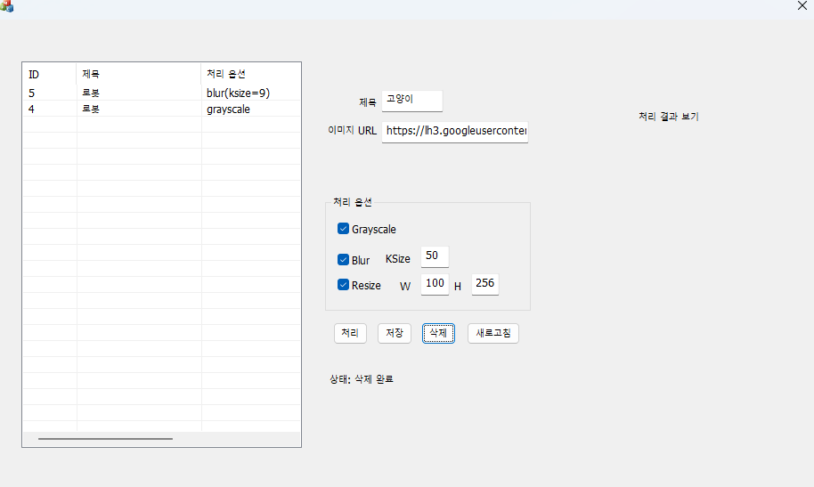

# Image Management Program
MFC 기반 이미지 관리 프로그램.  
개발했던 이미지 처리 [api 서버](https://github.com/seje06/cv-api_project/blob/main/README.md)를 활용하는 [cpp라이브러리](https://github.com/seje06/cv_api_cpp_sdk/blob/main/README.md)를 활용하여 간단한 이미지 관리 프로그램 개발

---

## Overview

이 프로젝트는 이미지 처리 API를 단순 호출하는 수준에서 끝내지 않고,  
**MFC GUI + Image Api C++ SDK + MySQL**을 연결해  
처리 결과를 관리할 수 있는 데스크톱 프로그램 형태로 확장한 프로젝트다.

사용자는 이미지 URL과 처리 옵션을 입력하고,  
서버에서 처리된 결과를 받아 프로그램 내에서 확인한 뒤 저장할 수 있다.  
저장된 결과는 목록으로 조회할 수 있으며, 선택 시 다시 미리보기로 확인할 수 있다.

- 

---

## Features

- 이미지 URL 입력
- 처리 옵션 선택
  - Grayscale
  - Blur
  - Resize
- **cv api C++ SDK**를 통한 이미지 처리 요청
- 처리 결과 미리보기
- 처리 결과를 **MySQL LONGBLOB**으로 저장
- 저장된 결과 목록 조회
- 저장된 결과 선택 시 이미지 다시 표시
- 저장 결과 삭제

---

## Tech Stack

- **Language**
  - C++
- **GUI**
  - MFC
- **Image API Client**
  - 직접 개발한 `cv api C++ SDK`
- **Database**
  - MySQL 80
- **DB Connector**
  - MySQL Connector/C++/9.6 (legacy JDBC API)

---

## Why This Project

Api Server를 구현하고, 활용 라이브러리도 개발 했으니, 해당 라이브러리를 활용하여
실제로 결과를 저장하고 다시 조회할 수 있는 **관리형 데스크톱 프로그램**을 만들어보고 싶었다.

---

## Project Structure

```text
image_management_program/
├─ include/                  # 공용 헤더
├─ lib/
│  ├─ Debug/
│  └─ Release/
├─ MfcProgramDlg.cpp         # 메인 다이얼로그 UI / 이벤트 처리
├─ MfcProgramDlg.h
├─ ImageRepository.cpp       # MySQL CRUD
├─ ImageRepository.h
├─ ImageApiService.cpp       # cv api C++ SDK 호출 래핑
├─ ImageApiService.h
├─ TempImageUtil.cpp         # BLOB 데이터를 임시 이미지 파일로 변환
├─ TempImageUtil.h
├─ AppModels.h               # 공용 모델 구조체
├─ DbConfig.h                # DB 접속 설정
└─ StringUtil.h              # CString / std::string 변환 유틸
```

---

## Main Flow

### 1. 이미지 처리
1. 사용자가 제목, 이미지 URL, 처리 옵션 입력
2. `ImageApiService`가 `cv api C++ SDK`를 통해 서버 요청
3. 처리 결과 이미지 바이트 수신
4. 결과 이미지 미리보기 표시
5. 사용자가 저장 버튼 클릭 시 DB 저장

### 2. 저장 결과 조회
1. 프로그램 시작 시 DB 연결
2. `processed_images` 테이블 목록 조회
3. 목록을 `CListCtrl`에 출력
4. 항목 선택 시 BLOB 데이터 조회
5. 임시 파일로 변환 후 결과 이미지 표시

### 3. 삭제
1. 목록에서 항목 선택
2. 선택한 ID 기준 DB 삭제
3. 리스트 갱신
4. 이미지 표시 영역 초기화

- 
- 
- 

---

## Database Schema

```sql
CREATE TABLE processed_images (
    id INT AUTO_INCREMENT PRIMARY KEY,
    title VARCHAR(100) NOT NULL,
    image_url VARCHAR(500) NOT NULL,
    operation_summary TEXT NOT NULL,
    output_format VARCHAR(20) NOT NULL,
    image_data LONGBLOB NOT NULL,
    created_at DATETIME NOT NULL DEFAULT CURRENT_TIMESTAMP
);
```

### Schema Notes

- `image_url`  
  원본 이미지 경로 대신 URL 저장

- `operation_summary`  
  사용자가 선택한 처리 옵션 요약 문자열 저장  
  예: `grayscale`, `blur(ksize=9)`, `resize(512x512)`

- `image_data`  
  처리 결과 이미지 자체를 `LONGBLOB`으로 저장

---

## Key Classes

### `ImageApiService`
MFC UI 코드와 SDK 코드를 직접 섞지 않기 위해 만든 서비스 계층.  
UI 입력값을 SDK 요청 형식으로 변환하고, 결과 이미지 바이트를 받아 반환한다.

### `ImageRepository`
MySQL Connector/C++를 사용해 DB CRUD를 담당한다.

주요 역할:
- DB 연결
- 테이블 생성 보장
- 처리 결과 insert
- 전체 목록 조회
- 단일 항목 상세 조회
- 삭제

### `TempImageUtil`
DB에서 읽은 BLOB 데이터를 바로 Picture Control에 넣기보다,  
임시 파일로 변환한 뒤 MFC 이미지 표시 함수에서 재사용할 수 있도록 분리했다.

### `MfcProgramDlg`
실제 사용자 입력과 UI 이벤트를 처리하는 메인 다이얼로그 클래스.

---

## Development Process

### 1. GUI 설계
초기에는 입력창, 옵션, 리스트 중심으로 구성했다.  
이후 결과 확인까지 가능해야 관리 프로그램으로서 의미가 있다고 판단해  
오른쪽에 결과 미리보기 영역을 추가했다.

### 2. SDK 연동
기존에 제작한 **cv api C++ SDK**를 재사용했다.  
MFC에서 직접 HTTP 호출을 구현하지 않고,  
별도의 서비스 클래스로 SDK 호출을 감싸 UI와 네트워크 로직을 분리했다.

### 3. DB 저장 방식 결정
처음에는 결과 이미지 파일 경로만 저장하는 방식도 고려했지만,  
최종적으로는 **처리 결과 이미지 자체를 LONGBLOB으로 저장**하는 방식으로 결정했다.

이 방식은:
- 파일 유실 문제를 줄일 수 있고
- DB만으로 결과를 관리할 수 있으며
- “이미지 데이터를 DB에 직접 저장/복원”하는 경험을 얻을 수 있다는 장점이 있었다. 하지만 테이블이 무거워지는 단점도 있다.

### 4. BLOB 이미지 미리보기 구현
DB에서 꺼낸 이미지 바이트를 임시 파일로 저장한 뒤  
`CImage`로 로드해서 Picture Control에 표시하도록 구현했다.

---

## Troubleshooting

### 1. MySQL Connector/C++ 연결 중 런타임 크래시
초기에는 단순 계정/비밀번호 문제로 보였지만,  
실제로는 **CRT / RuntimeLibrary 불일치**와  
Debug/Release 라이브러리 혼용 문제가 겹쳐 발생한 문제였다.

해결:
- MFC 프로젝트와 SDK의 런타임 설정 정리
- Release 빌드 기준으로 라이브러리 재정렬
- MySQL Connector, libcurl, zlib 링크 경로 재설정

### 2. 결과 이미지가 표시되지 않음
초기에는 Picture Control ID/스타일 문제로 접근했지만,  
실제로는 이미지 표시 영역 처리와 컨트롤 생성/크기 문제를 단계적으로 확인해야 했다.

해결:
- Picture Control 설정 재정리
- 이미지 표시 로직 보완
- 표시 영역 기준 비율 유지 리사이즈 적용

---

## Limitations

- 현재는 이미지 입력 방식이 URL 기반만 지원
- 처리 옵션 종류가 제한적
- 목록 항목 선택 시 옵션 상태를 UI에 역으로 복원하지 않음

---

## Future Improvements

- 처리 옵션 종류 확장
- output format 선택 기능 추가
- 썸네일 목록 표시
- 선택 항목의 처리 옵션 UI 복원
- 페이지네이션 / 검색 기능 추가
- 원본 이미지와 결과 이미지를 함께 비교하는 화면 구성
